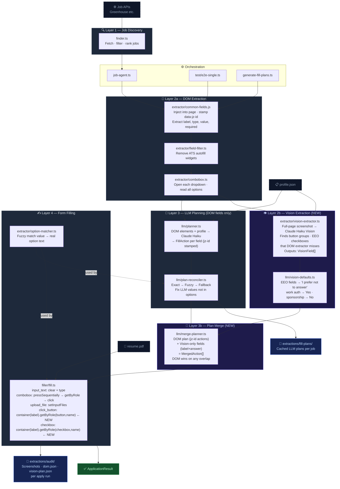

# Jobzippy Job-Agent Architecture

## Pipeline Summary

| Layer | What it does | Key tech |
|---|---|---|
| **Discovery** | Finds matching jobs from APIs, filters by profile preferences | Greenhouse API |
| **DOM Extraction** | Injects script into live form, stamps every field with `data-jz-id`, expands all dropdowns to read real options | Playwright + `common-fields.js` |
| **Field Filter** | Removes ATS autofill widgets (Ashby resume-autofill) before LLM sees them | `field-filter.ts` |
| **Vision Extraction** *(new)* | Takes full-page screenshot, asks Claude Vision for ALL visible fields including button groups and EEO checkboxes that DOM misses. Returns `VisionField[]` with `visual_type`, `choices`, `answer` | Claude Haiku Vision |
| **LLM Planning** | Sends **DOM-only** enriched field list + profile to LLM, gets back a `FillAction` per field (jz-id stamped, real option values) | Claude Haiku (Anthropic) |
| **Plan Reconciler** | Catches LLM values not in the options list — corrects before any fill attempt | Pure TS logic |
| **Plan Merge** *(new)* | Combines DOM jz-id plan + vision-only fields into `MergedAction[]`. DOM always wins on overlap. Vision adds fields DOM never saw. | Pure TS logic |
| **Filling** | Executes each action. DOM actions → `data-jz-id`. Vision `click_button` → proximity text selector. | Playwright |

## Key Design Decisions

- **Vision is additive only** — DOM-stamped actions are never replaced by vision. LLM never sees vision fields.
- **Single screenshot per apply** — one Claude Vision call covers the entire form gap. ~$0.002/apply with Haiku.
- **Proximity text selector for vision actions** — `page.locator('*', { hasText: label }).last().getByRole('button', { name: answer })` — no coordinates, no Stagehand dependency.
- **EEO defaults without LLM** — `vision-defaults.ts` pattern-matches question text to apply "I prefer not to answer" automatically.
- **`common-fields.js` untouched** — Skyvern vendor code stays pristine. All augmentation is post-extraction.
- **Combobox options read at extraction time** — LLM sees real options, not guesses.
- **Plan reconciler as a named layer** — LLM drift is corrected deterministically, not by re-prompting.
- **`pressSequentially` not `fill()`** — keeps React dropdown open during typing.
- **`getByRole('option')` no `force:true`** — fires proper mousedown/up/click events so React registers the selection.
